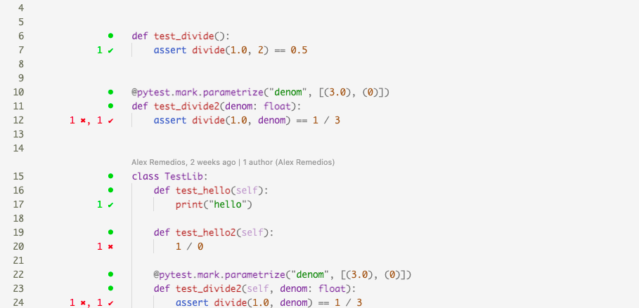

<p align="center">
  
</p>
<p align="center">See test results for every line of Python code

</p>
<p align="center">
  <a href="https://pypi.org/project/deepcov"></a>
  <a href="https://pypi.org/project/deepcov"></a>
  <a href="https://twitter.com/treebeardtech"></a>
</p>

**<div style="font-size:21px">🚧 under construction, do not attempt to use 🚧</div>**

The goal of this project is to make it easier to identify the root cause of pytest failures.

Deepcov lets you view coverage data for each individual test case in VSCode to identify which (if any) changes in your code caused failures.

## The Problem

You are working on a bug fix. Main branch is clean according to CI, so you create a branch then put in a few source changes. All config and dependencies remain unchanged.

Let's run some tests before opening a PR:

```log
FAILED workflow_handler/tests/test_model_r13n.py::TestR13n::test_when_data_not_fetched_then_no_regional_update
FAILED workflow_handler/tests/test_model_r13n.py::TestR13n::test_connect
FAILED workflow_handler/tests/test_model_r13n.py::TestR13n::test_when_data_fetched_then_update
====== 3 failed, 510 passed, 2 xfailed, 51 warnings in 140.83s (0:02:20) =======
```

These tests look unfamiliar. They may be new, and I don't think they are related to my change. The error logs are hard to decipher.

What could be wrong?

1. False positive: The tests are not configured for my dev environment
2. False positive: The tests are flaky, due to a network dependency/race condition
3. True positive: My code has somehow modified these testcases
4. Some combination of the above

There are various courses of action I can take to make sense of this. Re-running the suite, debugging individual tests or opening a PR to run CI can help, but are time consuming.

Deepcov proposes a way of identifying if your code change has impacted a test without re-running failures.

## The Solution

Deepcov shows lines of code that were run by failing tests, so you can connect test failures with source changes.

### Pre-req: Capture test coverage and results when you run pytest

```zsh
pip install -U pytest pytest-cov

pytest \
  --cov=src \            # Collect coverage data for your repo
  --cov-context=test \   # Ensure coverage data is segmented per-test
  --junit-xml=results.xml # Output test results
```

### View the code ran by failing tests

When coverage and test report data is captured, you can view test statuses for each line of code.

<p align="center">
  
</p>

## See also

- https://arxiv.org/abs/1607.04347
- https://github.com/saeg/jaguar
- https://arxiv.org/pdf/1607.04347.pdf