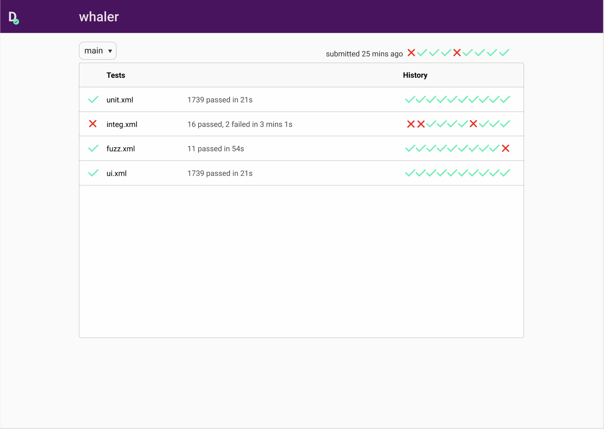
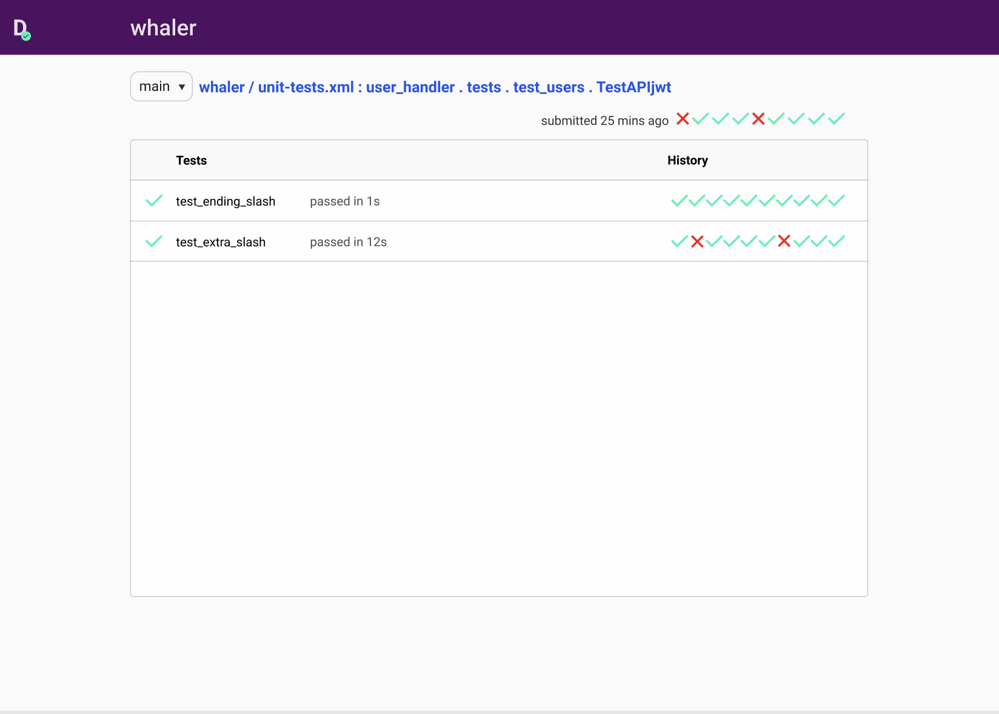
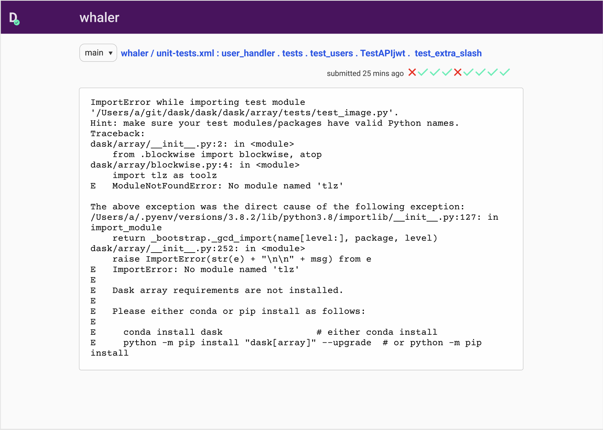
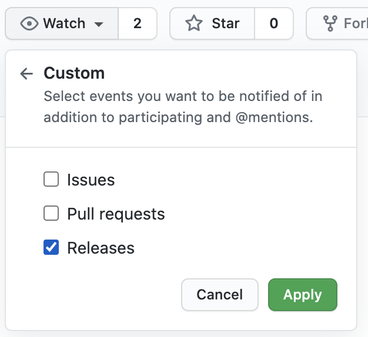

# deeptest

**<div style="font-size:21px">🚧 under construction, do not attempt to use 🚧</div>**


[](https://pypi.org/project/deeptest)
[](https://pypi.org/project/deeptest) [](https://treebeard.io/slack) [](https://twitter.com/treebeardtech)

**What?** A dashboard for storing and exploring test reports

**Why?** Tests are a huge component of complex projects. If they are not monitored and maintained, [broken windows](https://en.wikipedia.org/wiki/Broken_windows_theory) will emerge: slow tests and flaky test suites. Deeptest increases the visibility of test quality to let you maintain a high bar.

**Who is this for?** Devops-focussed engineers working with large volumes of test cases and test suites.

## User Stories

Deeptest allows you to:
1. Verify all test suites are passing on `main` branch before creating your feature branch
2. Identify if the tests failing on your PR have been failing recently on the target branch
3. Investigate the root cause of a failing test by comparing recent reports

You can use deeptest with any test framework that can output a JUnit XML report. Current and historical data will then be visible in the web UI:

<p align="center">
  
</p>

<br/>

Explore test duration and reliability/flakiness at any level of the hierarchy.
<p align="center">
  
</p>

View individual error messages and compare them with previous runs.
<p align="center">
  
</p>

## Quick Start

**<div style="font-size:21px">🚧 under construction, will not work 🚧</div>**

### Run your local server
```bash
~/git/whaler ➜ pip install deeptest

~/git/whaler ➜ deeptest serve

listening on localhost:8000...
```

### Submit directory of test reports

```bash
# run tests...
~/git/whaler ➜ pytest --junit-xml=reports/unit.xml
# <...run more tests...>


~/git/whaler ➜ deeptest upload ./reports
Uploading...done!

Submitted:
- unit.xml
- integ.xml
- fuzz.xml
- ui.xml

View your project at localhost:8000/whaler/main
```

### Check your tests are stored with deeptest
```
open localhost:8000/whaler/main
```

Will open UI shown above in your browser.


## Deploying

**<div style="font-size:21px">🚧 under construction, will not work 🚧</div>**

Use the official deeptest docker image for setting up a long-running deployment on your local device or on a cloud VM.

```
docker run -v $(pwd):/workspace treebeardtech/deeptest
```

Deeptest will use the current directory as a persistent store. **Deleting this directory/the host machine will wipe the data store.**

A future release will let you use a cloud bucket/external database for more durable persistence.

## Export a junit.xml report in your language

- python: `pytest --junit-xml=reports/unit.xml`
- golang: https://github.com/jstemmer/go-junit-report
- javascript (jest): https://github.com/jest-community/jest-junit

please submit an issue to add more


## Don't miss the 0.1 release

Watch for releases and give feedback when we launch!
<p align="left">
  
</p>