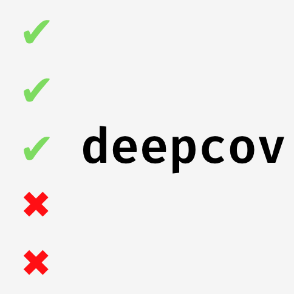

  

See test results for every line of Python code

  
  
  

**Deepcov is a pytest plugin + VSCode extension which combines test status and code coverage data.**

<!-- Deepcov combines test results with code coverage data to help you understand the root cause of failures. -->

## Making Sense of Test Runs

Tests can often fail due to unreliable infrastructure, such as network dependencies. When this happens, it can be difficult figuring out if we should let it distract us from what we're working on.

What if we just wanted to pay attention to tests running through components we have changed?

**Pytest** can tell us if tests pass, but can't tell us if we changed their behaviour, whereas **coverage** data can tell us if tests are running through a component, but not if they are passing.

|                             | pytest | pytest-cov | pytest-deepcov |
|-----------------------------|--------|------------|----------------|
| indicates code health       | ✔      | ✖          | ✔              |
| data for every line of code | ✖      | ✔          | ✔              |
|                             |        |            |                |

## Tutorial

We are going to debug a toy test suite using deepcov.

Before starting, ensure you have python and VSCode installed.
### Run tests with deepcov attached
1. Fork and clone this repo
1. `code python-cli/tests/resources`
1. (optional) `virtualenv .venv; .venv/bin/activate`
1. `pip install pytest-deepcov`
1. `pytest --cov`

### View deepcov data
1. Install VSCode extension
1. Enable deepcov

## Deepcov Internals

The VSCode extension fetches data for each line of code the deepcov CLI which returns JSON.

You can use this approach to create plugins for other text editors.

## Limitations

`coveragepy` is used to capture coverage data using the Python trace hook. This means:
1. You cannot use the debugger and deepcov at the same time. Deepcov detects when the debugger is active and disables itself.
1. Everything takes 30% longer. It is best to only use deepcov to rerun subsets of a failing test suite.
## Diving Deeper

Having test results for every line of code opens up the possibility of implementing *spectrum-based fault localisation*
- https://arxiv.org/abs/1607.04347 contains a description of this technique and expected results
- https://github.com/saeg/jaguar implements the described heuristics in java
